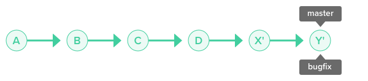
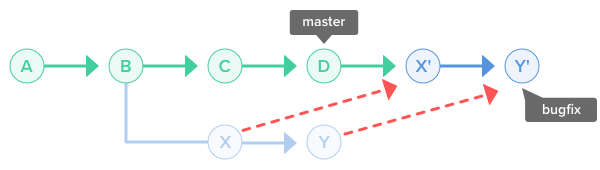
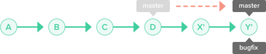

---
nav:
  title: 代码管理
  order: 5
title: 变基 git rebase
order: 23
---

# 变基 git rebase

> Reapply commits on top of another base tip
>
> 另一个基本提示上重新应用提交

如果需要获得更清晰的修订历史记录，可以使用 `git rebase` 命令集成分支。

## 变基至主分支

假设我们有两个分支，其中包含 `non-fast-forward` 方案。


```bash
# 变基 rebase 与合并 merge 不同，是基于被 rebase 的 commit 上操作的
# 切换至次分支
git checkout bugfix

# 变基至主分支
git rebase master

# 切换到主分支
git checkout master

# 再合并已经变基的 bugfix
git merge bugfix
```

整个 `bugfix` 分支上的提交会移动到 master 分支的后面，有效地把所有 master 分支上新的提交并入过来。

执行 `rebase` 命令将导致分支历史记录看起来类似于下面的图示。



当您将错误修复分支重新绑定到主分支时，将修复来自错误修复分支的提交并将其附加到主分支的末尾。最终结果是 `bugfix` 分支历史记录一个简单 commit 流。

如果在附加提交时发生代码冲突，Git 会要求您在继续重新设置其他提交之前修复冲突。





`rebase` 不会移动 `master` 分支的位置。在任何情况下，您都可以在 `rebase` 后执行从 `bugfix` 到 `master` 的 `fast-forward` 或清除合并。

对于 `merge` 和 `rebase` 的区别，实质上:

- `merge` 是对目前分叉的两条分支的合并
- `rebase` 是对当前分支记录基于任何 `commit` 节点（不限于当前分支上的节点）的变更

`rebase` 的 `base` 不能理解为分叉的基点，而是整个 `git` 库中存在的所有 `commit` 节点:

- 在 `git pull —-rebase` 的时候，这个当前分支是本地分支，`commit` 节点是远程分支的 `head`
- 在 `git rebase master` 的时候，这个当前分支是 `feature` 分支，`commit` 节点是 `master` 分支的 `head`
- 在 `git rebase -i` 的时候，这个当前分支就是当前工作分支，`commit` 节点是在 `-i` 后注明的 `commit`

## 交互式变基

交互式变基允许你更改并入新分支的提交。这比自动的变基更加强大，因为它提供了对分支上提交历史完整的控制。一般来说，这被用于将 `feature` 分支并入 `master` 分支之前，清理混乱的历史。

```bash
# 语法
git rebase -i [startpoint] [endpoint]

# 示例
git checkout feature
git rebase -i master
```

它会打开一个文本编辑器，显示所有将被移动的提交：

```bash
pick 33d5b7a Message for commit #1
pick 9480b3d Message for commit #2
pick 5c67e61 Message for commit #3
```

然后 `wq` 保存退出后是注释修改，编辑完注释再 `wq` 保存完成 commit 合并。

- pick：保留该 commit
- reword：保留该 commit，但我需要修改该 commit 的注释
- edit：保留该 commit，但我要停下来修改该提交（不禁惊修改注释）
- squash：将该 commit 和前一个 commit 合并
- fixup：将该 commit 和前一个 commit 合并，但我不要保留该提交的注释信息
- exec：执行 shell 命令
- drop：我要丢弃该 commit

忽略不重要的提交会让你的 feature 分支的历史更清晰易读，这是 `git merge` 做不到的。

## 分支合并

被合并分支只有你自己使用。

1. 先从 master 分支切出一个 `feature` 分支，进行开发：`git:(master) git checkout -b feature`
2. 这时同事完成一次 `hotfix`，且合并入 master 分支，此时 master 已经领先于你的 `feature` 分支
3. 使用 `git rebase master` 进行分支合并

`rebase` 原理：

1. 首先，git 会把 `feature` 分支里面的每个 `commit` 取消掉
2. 其次，把上面的操作临时保存成 `patch` 文件，存在 `.git/reabase` 目录下
3. 然后，把 `feature` 分支更新到最新的 `master` 分支
4. 最后，把上面保存的 `patch` 文件应用到 `feature` 分支上

在 `rebase` 过程中，出现冲突 conflict 后，git 会停止 rebase 并会让你解决冲突。解决完冲突后，用 `git add` 命令去更新这些内容，即执行 `git rebase --continue`。

⚠️ 注意：你无需执行 `git commit`，只要执行 `git rebase --continue`。

在任何时候，我们都可以用 `git rebase -abort` 来终止 `rebase` 的行动，并且分支会回到 `rebase` 开始前的状态。

## 黄金法则

> 永远不要对已经推到主干分支服务器或者团队其他成员的提交进行变基，我们选择变基还是合并的范围应该在自己当前工作范围内。

---

**参考资料：**

- [📝 Git 由浅入深之细说变基](https://juejin.im/post/58f97793a22b9d00658b15b6)
- [📝 关于 Git Rebase 你必须要知道的几件事](https://juejin.im/post/5ed47d006fb9a047da363b62)
- [📝 从撤销 Rebase 谈谈 Git 原理](https://juejin.im/post/5a65ac67f265da3e330473f7)
- [📝 使用 git rebase 提高 PR 质量](https://juejin.im/post/6844903497645686797)
- [📝 Merge 和 Rebase 区别与项目中的选择](https://juejin.im/post/5e3d78d1f265da575632453e)
- [📝 Git Merge 和 Rebase 分支合并命令的区别](https://juejin.im/post/5af26c4d5188256728605809)
- [📝 你根本不懂 rebase 使用 rebase 打造可读的 git graph](https://juejin.im/post/5cb20c45e51d456e2e656d11)
- [📝 Git 应用详解第九讲：git cherry-pick 与 git rebase](https://juejin.im/post/5e9d21f26fb9a03c4e648412)
- [📝 使用 Git Rebase 美化 GIt COmmit 流程](https://juejin.im/entry/59e5d7b051882521ae145b91/detail)
