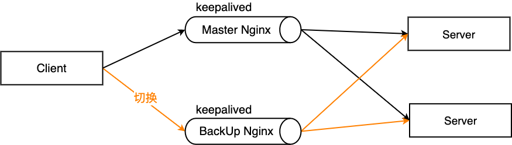

---
nav:
  title: 服务器
  order: 2
group:
  title: Nginx
  order: 1
title: 实用配置
order: 20
---

# 实用配置

## 静态服务

```nginx
server {
  listen       80;
  server_name  static.mrsingsing.com;
  charset utf-8;    # 防止中文文件名乱码

  location /download {
    alias                   /usr/share/nginx/html/static;  # 静态资源目录

    autoindex               on;    # 开启静态资源列目录
    autoindex_exact_size    off;   # on(默认)显示文件的确切大小，单位是byte；off显示文件大概大小，单位KB、MB、GB
    autoindex_localtime     off;   # off(默认)时显示的文件时间为GMT时间；on显示的文件时间为服务器时间
  }
}

```

## 图片防盗链

```nginx
server {
  listen       80;
  server_name  *.mrsingsing.com;

  # 图片防盗链
  location ~* \.(gif|jpg|jpeg|png|bmp|swf)$ {
    # 只允许本机 IP 外链引用，将百度和谷歌也加入白名单，有利于 SEO
    valid_referers none blocked server_names ~\.google\. ~\.baidu\. *.qq.com;
    if ($invalid_referer){
      return 403;
    }
  }
}
```

## 请求过滤

`deny` 和 `allow` 是 `ngx_http_access_module` 模块中的语法。在实际生产中，经常和 `ngx_http_geo_module` 模块配合使用。

```nginx
location / {
    # 禁止访问
    deny  192.168.1.100;
    # 允许 IP 段访问（已排除 100）
    allow 192.168.1.10/200;
    # 允许该单独 IP 访问
    allow 10.110.50.16;
    # 剩下未匹配到的全部禁止访问
    deny  all;
}
```

## 配置静态文件缓存

由于图片、字体、音频、视频等静态文件在打包的时候通常会增加了 `hash`，所以缓存可以设置的长一点，先设置强制缓存，再设置协商缓存；如果存在没有 `hash` 值的静态文件，建议不设置强制缓存，仅通过协商缓存判断是否需要使用缓存。

```nginx
# 图片缓存时间设置
location ~ .*\.(css|js|jpg|png|gif|swf|woff|woff2|eot|svg|ttf|otf|mp3|m4a|aac|txt)$ {
	expires 10d;
}

# 如果不希望缓存
expires -1;
```

## 单页面应用 history 路由配置

```nginx
server {
  listen       80;
  server_name  mrsingsing.com;

  location / {
    # vue 打包后的文件夹
    root       /usr/share/nginx/html/vue-/dist;
    index      index.html index.htm;
    # 解决页面刷新 404 问题
    try_files  $uri $uri/ /index.html @rewrites;

    # 首页一般没有强制缓存
    expires -1;
    add_header Cache-Control no-cache;
  }

  # 接口转发给后端处理
  location ~ ^/api {
    proxy_pass http://api.mrsingsing.com;
  }

  location @rewrites {
    rewrite ^(.+)$ /index.html break;
  }
}
```

## HTTP 请求转发到 HTTPS

配置完 HTTPS 后，浏览器还是可以访问 HTTP 的地址 `http://mrsingsing.com/` 的，可以做一个 `301` 跳转，把对应域名的 HTTP 请求重定向到 HTTPS 上。

```nginx
server {
    listen      80;
    server_name www.mrsingsing.com;

    # 单域名重定向
    if ($host = 'www.mrsingsing.com'){
        return 301 https://www.mrsingsing.com$request_uri;
    }

    # 全局非 HTTPS 协议时重定向
    if ($scheme != 'https') {
        return 301 https://$server_name$request_uri;
    }

    # 或者全部重定向
    return 301 https://$server_name$request_uri;

    # 以上配置选择自己需要的即可，不用全部加
}

```

## 泛域名路径分离

有时候我们可能需要配置一些二级或者三级域名，希望通过 Nginx 自动指向对应目录。例如：

1. `test.mrsingsing.com` 自动指向 `/usr/share/nginx/html/doc/test` 服务器地址
2. `pre.mrsingsing.com` 自动指向 `/usr/share/nginx/html/doc/pre` 服务器地址

```nginx
server {
    listen       80;
    server_name  ~^([\w-]+)\.mrsingsing\.com$;

    root /usr/share/nginx/html/doc/$1;
}
```

## 泛域名转发

和之前的功能类似，有时候我们希望把二级或者三级域名链接重写到我们希望的路径，让后端就可以根据路由解析不同的规则：

1. `test.mrsingsing.com/api?id=1` 自动转发到 `127.0.0.1:8080/test/api?id=1`
2. `pre.mrsingsing.com/api?id=1` 自动转发到 `127.0.0.1:8080/pre/api?id=1`

```nginx
server {
    listen       80;
    server_name ~^([\w-]+)\.mrsingsing\.com$;

    location / {
        proxy_set_header        X-Real-IP $remote_addr;
        proxy_set_header        X-Forwarded-For $proxy_add_x_forwarded_for;
        proxy_set_header        Host $http_host;
        proxy_set_header        X-NginX-Proxy true;
        proxy_pass              http://127.0.0.1:8080/$1$request_uri;
    }
}
```

## 合并请求

通过 `nginx-http-concat` 模块（淘宝开发的第三方模块，需单独安装）用一种特殊的请求 URL 规则（例如：`https://www.example.com/??a.js,b.js,c.js`），前端可将多个资源请求合并成一个请求，服务端 Nginx 会获取各个资源并拼接成一个结果进行返回。

```nginx
# JavaScript 资源 http-concat
# nginx-http-concat 模块的参数远不止下面三个，剩下的请查阅文档
location /static/js/ {
    # 是否打开资源合并开关
    concat on;
    # 允许合并的资源类型
    concat_types application/javascript;
    # 是否允许合并不同类型的资源
    concat_unique off;
    # 允许合并的最大资源数目
    concat_max_files 5;
}
```

## 页面内容修改

Nginx 可以通过向页面底部或者顶部插入额外的 CSS 和 JS 文件，从而实现修改页面内容。这个功能需要额外模块的支持，例如：`nginx_http_footer_filter` 或者 `ngx_http_addition_module` (都需要安装)。

工作中，经常需要切换各种测试环境，而通过 `switchhosts` 等工具切换后，有时还需要清理浏览器 DNS 缓存。可以通过 `页面内容修改 + Nginx 反向代理` 来实现轻松快捷的环境切换。

这里首先在本地编写一段 JavaScript 代码（`switchhost.js`），里面的逻辑是：在页面插入 hosts 切换菜单以及点击具体某个环境时，将该 `host` 的 IP 和 `hostname` 储存在 Cookie 中，最后刷新页面；接着编写一段 CSS 代码（`switchhost.css`）用来设置该 `hosts` 切换菜单的样式。

然后 Nginx 脚本配置：

```nginx
server {
    listen 80;
    listen  443 ssl;
    expires -1;

    # 想要代理的域名
    server_name m-element.kaola.com;
    set $root /Users/cc/Desktop/server;
    charset utf-8;
    ssl_certificate      /usr/local/etc/nginx/m-element.kaola.com.crt;
    ssl_certificate_key  /usr/local/etc/nginx/m-element.kaola.com.key;

    # 设置默认 $switch_host，一般默认为线上 host，这里的 1.1.1.1 随便写的
    set $switch_host '1.1.1.1';
    # 设置默认 $switch_hostname，一般默认为线上 'online'
    set $switch_hostname '';

    # 从 Cookie 中获取环境 IP
    if ($http_cookie ~* "switch_host=(.+?)(?=;|$)") {
        set $switch_host $1;
    }

    # 从 Cookie 中获取环境名
    if ($http_cookie ~* "switch_hostname=(.+?)(?=;|$)") {
        set $switch_hostname $1;
    }

    location / {
        expires -1;
        index index.html;
        proxy_set_header Host $host;
        # 把 HTML 页面的 gzip 压缩去掉，不然 sub_filter 无法替换内容
        proxy_set_header Accept-Encoding '';
        # 反向代理到实际服务器 IP
        proxy_pass  http://$switch_host:80;
        # 全部替换
        sub_filter_once off;
        # ngx_http_addition_module 模块替换内容。
        # 这里在头部插入一段 CSS，内容是 hosts 切换菜单的 CSS 样式
        sub_filter '</head>' '</head><link rel="stylesheet" type="text/css" media="screen" href="/local/switchhost.css" />';
        # 将页面中的'网易考拉'文字后面加上环境名，便于开发识别目前环境
        sub_filter '网易考拉' '网易考拉:${switch_hostname}';
        # 这里用了另一个模块nginx_http_footer_filter，其实上面的模块就行，只是为了展示用法
        # 最后插入一段js，内容是hosts切换菜单的js逻辑
        set $injected '<script language="javascript" src="/local/switchhost.js"></script>';
        footer '${injected}';
    }

    # 对于/local/请求，优先匹配本地文件
    # 所以上面的/local/switchhost.css，/local/switchhost.js会从本地获取
    location ^~ /local/ {
        root $root;
    }
}

```

## 配置动静分离

动静分离就是把动态和静态的请求分开。方式主要有两种：一种 是纯粹把静态文件独立成单独的域名，放在独立的服务器上，也是目前主流推崇的方案。另外一种方法就是动态跟静态文件混合在一起发布， 通过 Nginx 配置来分开。

```nginx
upstream static {
    server 192.167.4.31:80;
}

upstream dynamic {
    server 192.167.4.32:8080;
}

server {
    listen       80;   #监听端口
    server_name  www.mrsingsing.com; 监听地址

    # 拦截动态资源
    location ~ .*\.(php|jsp)$ {
       proxy_pass http://dynamic;
    }

    # 拦截静态资源
    location ~ .*\.(jpg|png|htm|html|css|js)$ {
       root /data/;  #html目录
       proxy_pass http://static;
       autoindex on;;  #自动打开文件列表
    }
}
```

## 配置高可用集群（双机热备）

当主 Nginx 服务器宕机之后，切换到备份 Nginx 服务器



安装 `keepalived`

```bash
yum install keepalived -y
```

然后编辑 `/etc/keepalived/keepalived.conf` 配置文件，并在配置文件中增加 `vrrp_script` 定义一个外围检测机制，并在 `vrrp_instance` 中通过定义 `track_script` 来追踪脚本执行过程，实现节点转移：

```nginx
global_defs{
   notification_email {
        acassen@firewall.loc
   }
   notification_email_from Alexandre@firewall.loc
   smtp_server 127.0.0.1
   smtp_connect_timeout 30                          # 上面都是邮件配置，没卵用
   router_id LVS_DEVEL                              # 当前服务器名字，用 hostname 命令来查看
}
vrrp_script chk_maintainace {                       # 检测机制的脚本名称为 chk_maintainace
    script "[[ -e/etc/keepalived/down ]] && exit 1 || exit 0" # 可以是脚本路径或脚本命令
    # script "/etc/keepalived/nginx_check.sh"       # 比如这样的脚本路径
    interval 2  # 每隔 2 秒检测一次
    weight -20  # 当脚本执行成立，那么把当前服务器优先级改为-20
}
vrrp_instanceVI_1 {             # 每一个 vrrp_instance 就是定义一个虚拟路由器
    state MASTER                # 主机为 MASTER，备用机为 BACKUP
    interface eth0              # 网卡名字，可以从 ifconfig 中查找
    virtual_router_id 51        # 虚拟路由的 id 号，一般小于 255，主备机 id 需要一样
    priority 100                # 优先级，master 的优先级比 backup 的大
    advert_int 1                # 默认心跳间隔
    authentication {            # 认证机制
        auth_type PASS
        auth_pass 1111          # 密码
    }
    virtual_ipaddress {         # 虚拟地址 vip
       172.16.2.8
    }
}
```

其中检测脚本 nginx_check.sh，这里提供一个：

```bash
#!/bin/bash
A=`ps -C nginx --no-header | wc -l`
if [ $A -eq 0 ];then
    /usr/sbin/nginx # 尝试重新启动nginx
    sleep 2         # 睡眠2秒
    if [ `ps -C nginx --no-header | wc -l` -eq 0 ];then
        killall keepalived # 启动失败，将keepalived服务杀死。将vip漂移到其它备份节点
    fi
fi
```

复制一份到备份服务器，备份 Nginx 的配置要将 `state` 后改为 `BACKUP`，`priority` 改为比主机小。设置完毕后各自 `service keepalived start` 启动，经过访问成功之后，可以把 `Master` 机的 `keepalived` 停掉，此时 `Master` 机就不再是主机了 `service keepalived stop`，看访问虚拟 IP 时是否能够自动切换到备机 `ip addr`。再次启动 `Master` 的 `keepalived`，此时 `vip` 又变到了主机上。

## 适配 PC 或移动设备

根据用户设备不同返回不同样式的站点，以前经常使用的是纯前端的自适应布局，但无论是复杂性和易用性上面还是不如分开编写的好，比如我们常见的淘宝、京东......这些大型网站就都没有采用自适应，而是用分开制作的方式，根据用户请求的 `user-agent` 来判断是返回 PC 还是 H5 站点。

```nginx
server {
  listen 80;
    server_name mrsingsing.com;

    location / {
        root  /usr/share/nginx/html/pc;

        if ($http_user_agent ~* '(Android|webOS|iPhone|iPod|BlackBerry)') {
            root /usr/share/nginx/html/mobile;
        }

        index index.html;
    }
}
```

## 持久连接

HTTP 运行在 TCP 连接之上，自然也有着跟 TCP 一样的三次握手、慢启动等特性。

启用持久连接情况下，服务器发出响应后让 TCP 连接继续打开着。同一对客户/服务器之间的后续请求和响应可以通过这个连接发送。

为了尽可能的提高 HTTP 性能，使用持久连接就显得尤为重要了。

HTTP/1.1 默认支持 TCP 持久连接，HTTP/1.0 也可以通过显式指定 Connection: keep-alive 来启用持久连接。对于 TCP 持久连接上的 HTTP 报文，客户端需要一种机制来准确判断结束位置，而在 HTTP/1.0 中，这种机制只有 Content-Length。而在 HTTP/1.1 中新增的 Transfer-Encoding: chunked 所对应的分块传输机制可以完美解决这类问题。

nginx 同样有着配置 chunked 的属性 chunked_transfer_encoding，这个属性是默认开启的。

Nginx 在启用了 GZip 的情况下，不会等文件 GZip 完成再返回响应，而是边压缩边响应，这样可以显著提高 TTFB(Time To First Byte，首字节时间，WEB 性能优化重要指标)。这样唯一的问题是，Nginx 开始返回响应时，它无法知道将要传输的文件最终有多大，也就是无法给出 Content-Length 这个响应头部。

所以，在 HTTP1.0 中如果利用 Nginx 启用了 GZip，是无法获得 Content-Length 的，这导致 HTTP1.0 中开启持久链接和使用 GZip 只能二选一，所以在这里 gzip_http_version 默认设置为 1.1。

## 其他配置

- [Nginx 出现 500 Internal Server Error 错误的解决方案](https://www.cnblogs.com/hiit/p/8568480.html)
- [Nginx: Stat() failed(13: permission denied)](https://www.jianshu.com/p/61dc693a51f1)
- [Nginx 405 not allowed 最简单快速解决方法](https://blog.csdn.net/zhaoxiace/article/details/86146797)

---

**参考资料：**

- [Nginx 与前端开发](https://juejin.im/post/5bacbd395188255c8d0fd4b2)
